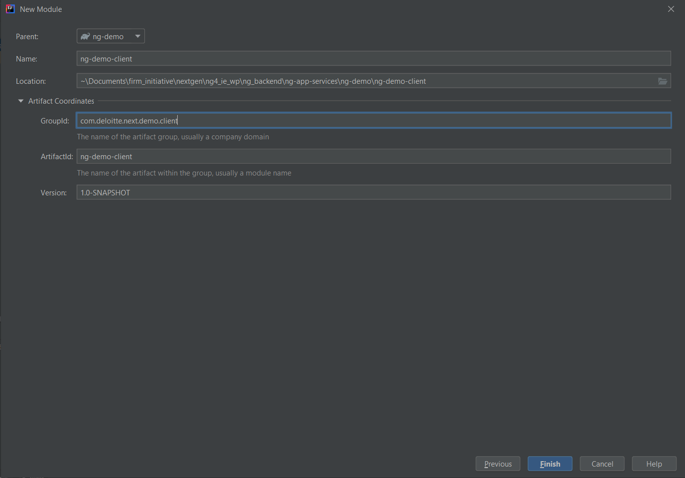

=== SDK, IDE and Software

* Download Java 8 from https://www.oracle.com/in/java/technologies/javase/javase-jdk8-downloads.html[here].
Choose Windows X64 product for JDK.
* Download IntelliJ Community Edition from https://www.jetbrains.com/idea/download/#section=windows[here]
* Download Visual Studio Community Edition from https://visualstudio.microsoft.com/downloads/[here]
* Download Docker from https://docs.docker.com/docker-for-windows/install/[here]

=== IDE Plugins

|===

|IntelliJ|Eclipse

|Lombok
|

|Asciidoc
|

|Mapstruct Support
|

|Spring Assistant
|

|===

[NOTE]
All the above files are .exe files, double-clicking on the respective file will open installation wizard.
Follow the steps in wizard and install it. We recommend installing Java 8 first and then other software.

=== Creating Project

The section will go through on how we can create a project and sub modules to get started.
Please follow the step as mention below.

==== Root Project

. Go to `File` > `New Project`
. Select `Gradle` and click on `Next`

. Mention the project name and mention the Group Id i.e. com.deloitte.nextgen.*<project_name>* +
e.g. com.deloitte.nextgen.*demo*. Click `Finish`.

==== Sub Module - Web

. `Right Click` on Root Project Select `New` > `Modules`
. Mention the module name and change the group id to com.deloitte.nextgen.*<project_name>*.*<module>* +
e.g. com.deloitte.nextgen.*demo*.*web* Click `Finish`.

==== Sub Module - Client

. `Right Click` on Root Project Select `New` > `Modules`
. Mention the module name and change the group id to com.deloitte.nextgen.*<project_name>*.*<module>* +
e.g. com.deloitte.nextgen.*demo*.*client* Click `Finish`.

==== Final Project layout
Below is the final project structure.

[TIP]
Repeat the above steps to create new modules.

[NOTE]
Create base packages as per the naming convention section. Refer to <<coding-guidelines, Coding Guidelines>>.

[sidebar]
icon:star[] *_Congratulations, you are ready to write some awesome code now._* icon:star[]

=== Gradle

Each gradle project or module have build.gradle file which helps gradle to identify project related settings.
We can add gradle plugins which eases the way we run/build project, create custom tasks, add dependency and many other
project related changes. In this section we will be updating build.gradle files to update our project.
To get more knowledge about gradle refer below quick links.

* https://docs.gradle.org/current/userguide/userguide.html[Gradle User Guide]
* https://medium.com/@andrewMacmurray/a-beginners-guide-to-gradle-26212ddcafa8[Medium Article]
* https://www.tutorialspoint.com/gradle/index.htm[Tutorials Point]
* https://www.petrikainulainen.net/getting-started-with-gradle/[Petri Kainulainen Blog]

[source, groovy, linenums]
.Adding NG Framework Starter Dependency in Web Project
----
dependencies {
    implementation 'com.deloitte.nextgen.framework:ng-spring-boot-starter:x.y.z'
}
----

[source, groovy, linenums]
.Adding NG Framework Independent module in a project
----
dependencies {
    implementation 'com.deloitte.nextgen.framework:ng-web:x.y.z'
    implementation 'com.deloitte.nextgen.framework:ng-persistence:x.y.z'
}
----

[NOTE]
Avoid adding starter dependency in your client project or any other module you create,
since it won't require all dependency mentioned in starter project.

[TIP]
Only add required dependency, avoid/remove unwanted dependencies. This will help in reduce size of jar.
